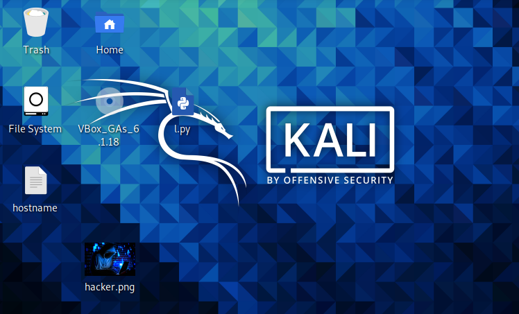
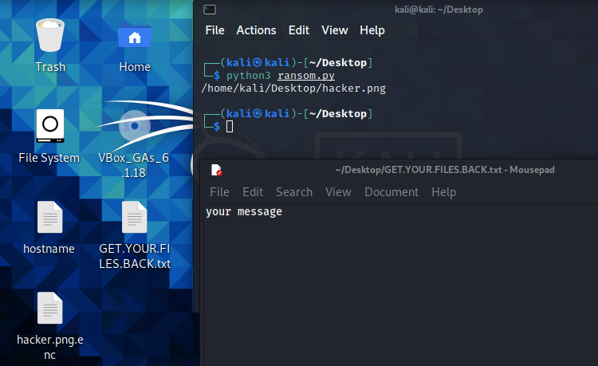
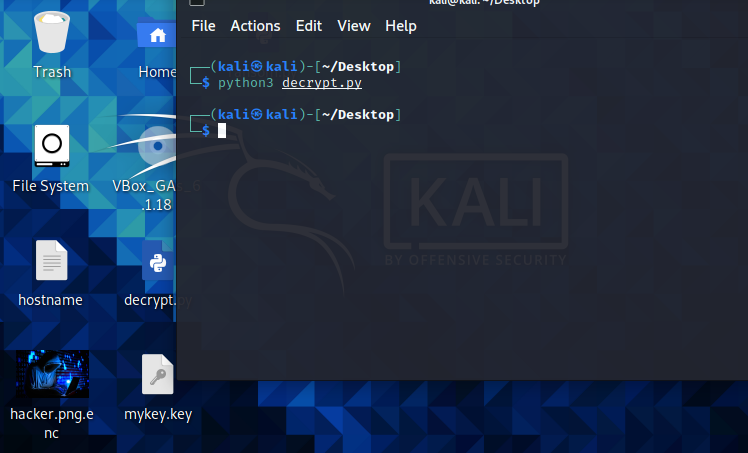

# ransomware
ransomware POC
* key_gen.py - [generate AES key].
* encrypt_single_file.py - [encrypt single files].
* decrypt.py - [decrypt all files encrypted with your key{you need to have the key in the same folder as this file}].
* ransom.py - [encrypt most of the important files on linux/windows/mac{cross platform}, only need the target to have python!]
* First you need to generate key then upload it on a server from which the ransomware will download it.
* Second open the ransom.py file with text editor or with python IDLE, find this line ===>     url = ('')     <====
and in the quotes paste your server link which points to your .key file,for example url = ('https://myserver.com/mykey.key')
 in line ===>   ransom_message = '''type your message here''' <=== type the message for the ransom,for example: pay 1 BTC to this address >your btc address< and email to this email example@mail.com to get your files back,then save the file and your ransom is ready for testing!
* ### requirements:
* python modules: pip install glob cryptography requests(you need to install them on the target and on your computer,you need to have cryptography module installed to be able to generate keys!).
* After the ransomware is done with the encryption it deletes itself.

### Only for educational purposes!
### Use it on your VM for tests only!
